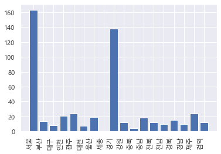

```python
#
# 파이썬 웹 크롤링을 이용하여, 데이터를 수집하고 분석하는 방법을 알아본다.
#
# 필요로 하는 패키지, 모듈, 클래스 등을 import
#
#
import requests
from bs4 import BeautifulSoup
import pandas as pd
from pandas import DataFrame, Series
import numpy as np
import matplotlib as mpl
import matplotlib.pyplot as plt

# 분석 대상 데이터를 가져올 소스 사이트
# http://ncov.mohw.go.kr/bdBoardList_Real.do?brdId=1&brdGubun=13&ncvContSeq=&contSeq=&board_id=&gubun=

# requests.get() 이용, 소스 사이트를 가져온다.
source = requests.get('http://ncov.mohw.go.kr/bdBoardList_Real.do?brdId=1&brdGubun=13&ncvContSeq=&contSeq=&board_id=&gubun=')
# BeautifulSoup(소스.content, 파서) 이용, htmp.parser
soup = BeautifulSoup(source.content, 'html.parser')

# 시도별 발생현황, 데이터를 가진 테이블을 찾는다.
# 검사 결과, <table class="num, midsize">
table = soup.find('table', {'class':'midsize'})
table = soup.find('tbody')

data = []

for tr in table.find_all('tr'):
    tds = list(tr.find_all('td'))
    rowdata = []
    for td in tds:
        rowdata.append(td.text.replace(',',''))
    # 한 행 구성
    #print(rowdata)
    data.append(rowdata)

# print(data)
# data를 dataframe으로 변환
column_name = ['hap','dom','abr','conf','blocked','relesed','death','occur']
index_name = ['합계','서울','부산','대구','인천','광주','대전','울산','세종','경기','강원','충북','충남','전북','전남','경북','경남','제주','검역']
df = DataFrame(data,columns=column_name, index=index_name)
print(df)
```

        hap  dom abr    conf blocked relesed death   occur
    합계  511  483  28  128283    7687  118717  1879  247.42
    서울  163  163   0   39895    2692   36739   464  409.87
    부산   14   13   1    5286     284    4880   122  154.93
    대구    8    8   0    9448     111    9116   221  387.77
    인천   21   20   1    5839     185    5594    60  197.52
    광주   24   23   1    2518     107    2389    22  172.86
    대전    7    7   0    1835     130    1685    20  124.48
    울산   19   19   0    2247     386    1823    38  195.90
    세종    0    0   0     386      27     358     1  112.76
    경기  138  127  11   35852    2019   33225   608  270.57
    강원   12   12   0    2843     184    2609    50  184.55
    충북    4    4   0    2708     112    2531    65  169.31
    충남   18   18   0    3175     181    2958    36  149.59
    전북   12   12   0    2033     115    1860    58  111.87
    전남   10   10   0    1178     141    1026    11   63.17
    경북   15   15   0    4352     294    3979    79  163.45
    경남   10    9   1    4268     367    3882    19  126.97
    제주   24   23   1     816     110     705     1  121.66
    검역   12    0  12    3604     242    3358     4       -
    


```python
df.info()
```

    <class 'pandas.core.frame.DataFrame'>
    Index: 19 entries, 합계 to 검역
    Data columns (total 8 columns):
     #   Column   Non-Null Count  Dtype 
    ---  ------   --------------  ----- 
     0   hap      19 non-null     object
     1   dom      19 non-null     object
     2   abr      19 non-null     object
     3   conf     19 non-null     object
     4   blocked  19 non-null     object
     5   relesed  19 non-null     object
     6   death    19 non-null     object
     7   occur    19 non-null     object
    dtypes: object(8)
    memory usage: 1.3+ KB
    


```python
df.head()
```


<div>
<style scoped>
    .dataframe tbody tr th:only-of-type {
        vertical-align: middle;
    }

    .dataframe tbody tr th {
        vertical-align: top;
    }

    .dataframe thead th {
        text-align: right;
    }
</style>
<table border="1" class="dataframe">
  <thead>
    <tr style="text-align: right;">
      <th></th>
      <th>hap</th>
      <th>dom</th>
      <th>abr</th>
      <th>conf</th>
      <th>blocked</th>
      <th>relesed</th>
      <th>death</th>
      <th>occur</th>
    </tr>
  </thead>
  <tbody>
    <tr>
      <th>합계</th>
      <td>511</td>
      <td>483</td>
      <td>28</td>
      <td>128283</td>
      <td>7687</td>
      <td>118717</td>
      <td>1879</td>
      <td>247.42</td>
    </tr>
    <tr>
      <th>서울</th>
      <td>163</td>
      <td>163</td>
      <td>0</td>
      <td>39895</td>
      <td>2692</td>
      <td>36739</td>
      <td>464</td>
      <td>409.87</td>
    </tr>
    <tr>
      <th>부산</th>
      <td>14</td>
      <td>13</td>
      <td>1</td>
      <td>5286</td>
      <td>284</td>
      <td>4880</td>
      <td>122</td>
      <td>154.93</td>
    </tr>
    <tr>
      <th>대구</th>
      <td>8</td>
      <td>8</td>
      <td>0</td>
      <td>9448</td>
      <td>111</td>
      <td>9116</td>
      <td>221</td>
      <td>387.77</td>
    </tr>
    <tr>
      <th>인천</th>
      <td>21</td>
      <td>20</td>
      <td>1</td>
      <td>5839</td>
      <td>185</td>
      <td>5594</td>
      <td>60</td>
      <td>197.52</td>
    </tr>
  </tbody>
</table>
</div>


```python
df.tail()
```


<div>
<style scoped>
    .dataframe tbody tr th:only-of-type {
        vertical-align: middle;
    }

    .dataframe tbody tr th {
        vertical-align: top;
    }

    .dataframe thead th {
        text-align: right;
    }
</style>
<table border="1" class="dataframe">
  <thead>
    <tr style="text-align: right;">
      <th></th>
      <th>hap</th>
      <th>dom</th>
      <th>abr</th>
      <th>conf</th>
      <th>blocked</th>
      <th>relesed</th>
      <th>death</th>
      <th>occur</th>
    </tr>
  </thead>
  <tbody>
    <tr>
      <th>전남</th>
      <td>10</td>
      <td>10</td>
      <td>0</td>
      <td>1178</td>
      <td>141</td>
      <td>1026</td>
      <td>11</td>
      <td>63.17</td>
    </tr>
    <tr>
      <th>경북</th>
      <td>15</td>
      <td>15</td>
      <td>0</td>
      <td>4352</td>
      <td>294</td>
      <td>3979</td>
      <td>79</td>
      <td>163.45</td>
    </tr>
    <tr>
      <th>경남</th>
      <td>10</td>
      <td>9</td>
      <td>1</td>
      <td>4268</td>
      <td>367</td>
      <td>3882</td>
      <td>19</td>
      <td>126.97</td>
    </tr>
    <tr>
      <th>제주</th>
      <td>24</td>
      <td>23</td>
      <td>1</td>
      <td>816</td>
      <td>110</td>
      <td>705</td>
      <td>1</td>
      <td>121.66</td>
    </tr>
    <tr>
      <th>검역</th>
      <td>12</td>
      <td>0</td>
      <td>12</td>
      <td>3604</td>
      <td>242</td>
      <td>3358</td>
      <td>4</td>
      <td>-</td>
    </tr>
  </tbody>
</table>
</div>


```python
df['hap'] = df['hap'].astype(int)
```


```python
df.info()
```

    <class 'pandas.core.frame.DataFrame'>
    Index: 19 entries, 합계 to 검역
    Data columns (total 8 columns):
     #   Column   Non-Null Count  Dtype 
    ---  ------   --------------  ----- 
     0   hap      19 non-null     int32 
     1   dom      19 non-null     object
     2   abr      19 non-null     object
     3   conf     19 non-null     object
     4   blocked  19 non-null     object
     5   relesed  19 non-null     object
     6   death    19 non-null     object
     7   occur    19 non-null     object
    dtypes: int32(1), object(7)
    memory usage: 1.3+ KB
    


```python
df['dom'] = df['dom'].astype(int)
df['abr'] = df['abr'].astype(int)
df['conf'] = df['conf'].astype(int)
df['blocked'] = df['blocked'].astype(int)
df['relesed'] = df['relesed'].astype(int)
df['death'] = df['death'].astype(int)
#df['발생률'] = df['발생률'].astype(float)
```


```python
df.info()
```

    <class 'pandas.core.frame.DataFrame'>
    Index: 19 entries, 합계 to 검역
    Data columns (total 8 columns):
     #   Column   Non-Null Count  Dtype 
    ---  ------   --------------  ----- 
     0   hap      19 non-null     int32 
     1   dom      19 non-null     int32 
     2   abr      19 non-null     int32 
     3   conf     19 non-null     int32 
     4   blocked  19 non-null     int32 
     5   relesed  19 non-null     int32 
     6   death    19 non-null     int32 
     7   occur    19 non-null     object
    dtypes: int32(7), object(1)
    memory usage: 836.0+ bytes
    


```python
df.describe()
```


<div>
<style scoped>
    .dataframe tbody tr th:only-of-type {
        vertical-align: middle;
    }

    .dataframe tbody tr th {
        vertical-align: top;
    }

    .dataframe thead th {
        text-align: right;
    }
</style>
<table border="1" class="dataframe">
  <thead>
    <tr style="text-align: right;">
      <th></th>
      <th>hap</th>
      <th>dom</th>
      <th>abr</th>
      <th>conf</th>
      <th>blocked</th>
      <th>relesed</th>
      <th>death</th>
    </tr>
  </thead>
  <tbody>
    <tr>
      <th>count</th>
      <td>19.000000</td>
      <td>19.000000</td>
      <td>19.000000</td>
      <td>19.000000</td>
      <td>19.000000</td>
      <td>19.000000</td>
      <td>19.000000</td>
    </tr>
    <tr>
      <th>mean</th>
      <td>53.789474</td>
      <td>50.842105</td>
      <td>2.947368</td>
      <td>13503.473684</td>
      <td>809.157895</td>
      <td>12496.526316</td>
      <td>197.789474</td>
    </tr>
    <tr>
      <th>std</th>
      <td>119.075410</td>
      <td>113.040928</td>
      <td>7.027515</td>
      <td>29923.055469</td>
      <td>1805.585970</td>
      <td>27688.382815</td>
      <td>438.437070</td>
    </tr>
    <tr>
      <th>min</th>
      <td>0.000000</td>
      <td>0.000000</td>
      <td>0.000000</td>
      <td>386.000000</td>
      <td>27.000000</td>
      <td>358.000000</td>
      <td>1.000000</td>
    </tr>
    <tr>
      <th>25%</th>
      <td>10.000000</td>
      <td>8.500000</td>
      <td>0.000000</td>
      <td>2140.000000</td>
      <td>113.500000</td>
      <td>1841.500000</td>
      <td>19.500000</td>
    </tr>
    <tr>
      <th>50%</th>
      <td>14.000000</td>
      <td>13.000000</td>
      <td>0.000000</td>
      <td>3175.000000</td>
      <td>184.000000</td>
      <td>2958.000000</td>
      <td>50.000000</td>
    </tr>
    <tr>
      <th>75%</th>
      <td>22.500000</td>
      <td>21.500000</td>
      <td>1.000000</td>
      <td>5562.500000</td>
      <td>330.500000</td>
      <td>5237.000000</td>
      <td>100.500000</td>
    </tr>
    <tr>
      <th>max</th>
      <td>511.000000</td>
      <td>483.000000</td>
      <td>28.000000</td>
      <td>128283.000000</td>
      <td>7687.000000</td>
      <td>118717.000000</td>
      <td>1879.000000</td>
    </tr>
  </tbody>
</table>
</div>


```python
df1 = df.drop('합계')
df1
```


<div>
<style scoped>
    .dataframe tbody tr th:only-of-type {
        vertical-align: middle;
    }

    .dataframe tbody tr th {
        vertical-align: top;
    }

    .dataframe thead th {
        text-align: right;
    }
</style>
<table border="1" class="dataframe">
  <thead>
    <tr style="text-align: right;">
      <th></th>
      <th>hap</th>
      <th>dom</th>
      <th>abr</th>
      <th>conf</th>
      <th>blocked</th>
      <th>relesed</th>
      <th>death</th>
      <th>occur</th>
    </tr>
  </thead>
  <tbody>
    <tr>
      <th>서울</th>
      <td>163</td>
      <td>163</td>
      <td>0</td>
      <td>39895</td>
      <td>2692</td>
      <td>36739</td>
      <td>464</td>
      <td>409.87</td>
    </tr>
    <tr>
      <th>부산</th>
      <td>14</td>
      <td>13</td>
      <td>1</td>
      <td>5286</td>
      <td>284</td>
      <td>4880</td>
      <td>122</td>
      <td>154.93</td>
    </tr>
    <tr>
      <th>대구</th>
      <td>8</td>
      <td>8</td>
      <td>0</td>
      <td>9448</td>
      <td>111</td>
      <td>9116</td>
      <td>221</td>
      <td>387.77</td>
    </tr>
    <tr>
      <th>인천</th>
      <td>21</td>
      <td>20</td>
      <td>1</td>
      <td>5839</td>
      <td>185</td>
      <td>5594</td>
      <td>60</td>
      <td>197.52</td>
    </tr>
    <tr>
      <th>광주</th>
      <td>24</td>
      <td>23</td>
      <td>1</td>
      <td>2518</td>
      <td>107</td>
      <td>2389</td>
      <td>22</td>
      <td>172.86</td>
    </tr>
    <tr>
      <th>대전</th>
      <td>7</td>
      <td>7</td>
      <td>0</td>
      <td>1835</td>
      <td>130</td>
      <td>1685</td>
      <td>20</td>
      <td>124.48</td>
    </tr>
    <tr>
      <th>울산</th>
      <td>19</td>
      <td>19</td>
      <td>0</td>
      <td>2247</td>
      <td>386</td>
      <td>1823</td>
      <td>38</td>
      <td>195.90</td>
    </tr>
    <tr>
      <th>세종</th>
      <td>0</td>
      <td>0</td>
      <td>0</td>
      <td>386</td>
      <td>27</td>
      <td>358</td>
      <td>1</td>
      <td>112.76</td>
    </tr>
    <tr>
      <th>경기</th>
      <td>138</td>
      <td>127</td>
      <td>11</td>
      <td>35852</td>
      <td>2019</td>
      <td>33225</td>
      <td>608</td>
      <td>270.57</td>
    </tr>
    <tr>
      <th>강원</th>
      <td>12</td>
      <td>12</td>
      <td>0</td>
      <td>2843</td>
      <td>184</td>
      <td>2609</td>
      <td>50</td>
      <td>184.55</td>
    </tr>
    <tr>
      <th>충북</th>
      <td>4</td>
      <td>4</td>
      <td>0</td>
      <td>2708</td>
      <td>112</td>
      <td>2531</td>
      <td>65</td>
      <td>169.31</td>
    </tr>
    <tr>
      <th>충남</th>
      <td>18</td>
      <td>18</td>
      <td>0</td>
      <td>3175</td>
      <td>181</td>
      <td>2958</td>
      <td>36</td>
      <td>149.59</td>
    </tr>
    <tr>
      <th>전북</th>
      <td>12</td>
      <td>12</td>
      <td>0</td>
      <td>2033</td>
      <td>115</td>
      <td>1860</td>
      <td>58</td>
      <td>111.87</td>
    </tr>
    <tr>
      <th>전남</th>
      <td>10</td>
      <td>10</td>
      <td>0</td>
      <td>1178</td>
      <td>141</td>
      <td>1026</td>
      <td>11</td>
      <td>63.17</td>
    </tr>
    <tr>
      <th>경북</th>
      <td>15</td>
      <td>15</td>
      <td>0</td>
      <td>4352</td>
      <td>294</td>
      <td>3979</td>
      <td>79</td>
      <td>163.45</td>
    </tr>
    <tr>
      <th>경남</th>
      <td>10</td>
      <td>9</td>
      <td>1</td>
      <td>4268</td>
      <td>367</td>
      <td>3882</td>
      <td>19</td>
      <td>126.97</td>
    </tr>
    <tr>
      <th>제주</th>
      <td>24</td>
      <td>23</td>
      <td>1</td>
      <td>816</td>
      <td>110</td>
      <td>705</td>
      <td>1</td>
      <td>121.66</td>
    </tr>
    <tr>
      <th>검역</th>
      <td>12</td>
      <td>0</td>
      <td>12</td>
      <td>3604</td>
      <td>242</td>
      <td>3358</td>
      <td>4</td>
      <td>-</td>
    </tr>
  </tbody>
</table>
</div>


```python
!pip install openpyxl
```

    Requirement already satisfied: openpyxl in c:\users\1\appdata\local\programs\python\python39\lib\site-packages (3.0.7)
    Requirement already satisfied: et-xmlfile in c:\users\1\appdata\local\programs\python\python39\lib\site-packages (from openpyxl) (1.1.0)
    


```python
df.to_excel('covid19.xlsx', sheet_name='test1')
```


```python
df1.describe()  # 기술통계량
```


<div>
<style scoped>
    .dataframe tbody tr th:only-of-type {
        vertical-align: middle;
    }

    .dataframe tbody tr th {
        vertical-align: top;
    }

    .dataframe thead th {
        text-align: right;
    }
</style>
<table border="1" class="dataframe">
  <thead>
    <tr style="text-align: right;">
      <th></th>
      <th>hap</th>
      <th>dom</th>
      <th>abr</th>
      <th>conf</th>
      <th>blocked</th>
      <th>relesed</th>
      <th>death</th>
    </tr>
  </thead>
  <tbody>
    <tr>
      <th>count</th>
      <td>18.000000</td>
      <td>18.000000</td>
      <td>18.000000</td>
      <td>18.000000</td>
      <td>18.000000</td>
      <td>18.000000</td>
      <td>18.000000</td>
    </tr>
    <tr>
      <th>mean</th>
      <td>28.388889</td>
      <td>26.833333</td>
      <td>1.555556</td>
      <td>7126.833333</td>
      <td>427.055556</td>
      <td>6595.388889</td>
      <td>104.388889</td>
    </tr>
    <tr>
      <th>std</th>
      <td>45.092244</td>
      <td>43.973588</td>
      <td>3.649693</td>
      <td>11403.712127</td>
      <td>717.421074</td>
      <td>10544.101028</td>
      <td>167.436077</td>
    </tr>
    <tr>
      <th>min</th>
      <td>0.000000</td>
      <td>0.000000</td>
      <td>0.000000</td>
      <td>386.000000</td>
      <td>27.000000</td>
      <td>358.000000</td>
      <td>1.000000</td>
    </tr>
    <tr>
      <th>25%</th>
      <td>10.000000</td>
      <td>8.250000</td>
      <td>0.000000</td>
      <td>2086.500000</td>
      <td>112.750000</td>
      <td>1832.250000</td>
      <td>19.250000</td>
    </tr>
    <tr>
      <th>50%</th>
      <td>13.000000</td>
      <td>12.500000</td>
      <td>0.000000</td>
      <td>3009.000000</td>
      <td>182.500000</td>
      <td>2783.500000</td>
      <td>44.000000</td>
    </tr>
    <tr>
      <th>75%</th>
      <td>20.500000</td>
      <td>19.750000</td>
      <td>1.000000</td>
      <td>5052.500000</td>
      <td>291.500000</td>
      <td>4654.750000</td>
      <td>75.500000</td>
    </tr>
    <tr>
      <th>max</th>
      <td>163.000000</td>
      <td>163.000000</td>
      <td>12.000000</td>
      <td>39895.000000</td>
      <td>2692.000000</td>
      <td>36739.000000</td>
      <td>608.000000</td>
    </tr>
  </tbody>
</table>
</div>


```python
df1.sum(axis=0)
```


    hap                                                      511
    dom                                                      483
    abr                                                       28
    conf                                                  128283
    blocked                                                 7687
    relesed                                               118717
    death                                                   1879
    occur      409.87154.93387.77197.52172.86124.48195.90112....
    dtype: object


```python
!pip install seaborn
```

    Requirement already satisfied: seaborn in c:\users\1\appdata\local\programs\python\python39\lib\site-packages (0.11.1)
    Requirement already satisfied: matplotlib>=2.2 in c:\users\1\appdata\local\programs\python\python39\lib\site-packages (from seaborn) (3.4.2)
    Requirement already satisfied: numpy>=1.15 in c:\users\1\appdata\local\programs\python\python39\lib\site-packages (from seaborn) (1.20.2)
    Requirement already satisfied: scipy>=1.0 in c:\users\1\appdata\local\programs\python\python39\lib\site-packages (from seaborn) (1.6.3)
    Requirement already satisfied: pandas>=0.23 in c:\users\1\appdata\local\programs\python\python39\lib\site-packages (from seaborn) (1.2.4)
    Requirement already satisfied: cycler>=0.10 in c:\users\1\appdata\local\programs\python\python39\lib\site-packages (from matplotlib>=2.2->seaborn) (0.10.0)
    Requirement already satisfied: python-dateutil>=2.7 in c:\users\1\appdata\local\programs\python\python39\lib\site-packages (from matplotlib>=2.2->seaborn) (2.8.1)
    Requirement already satisfied: pillow>=6.2.0 in c:\users\1\appdata\local\programs\python\python39\lib\site-packages (from matplotlib>=2.2->seaborn) (8.2.0)
    Requirement already satisfied: kiwisolver>=1.0.1 in c:\users\1\appdata\local\programs\python\python39\lib\site-packages (from matplotlib>=2.2->seaborn) (1.3.1)
    Requirement already satisfied: pyparsing>=2.2.1 in c:\users\1\appdata\local\programs\python\python39\lib\site-packages (from matplotlib>=2.2->seaborn) (2.4.7)
    Requirement already satisfied: six in c:\users\1\appdata\local\programs\python\python39\lib\site-packages (from cycler>=0.10->matplotlib>=2.2->seaborn) (1.15.0)
    Requirement already satisfied: pytz>=2017.3 in c:\users\1\appdata\local\programs\python\python39\lib\site-packages (from pandas>=0.23->seaborn) (2021.1)
    


```python
import matplotlib.pyplot as plt
%matplotlib inline
import platform
if platform.system() == 'Darwin': #맥
        plt.rc('font', family='AppleGothic') 
elif platform.system() == 'Windows': #윈도우
        plt.rc('font', family='Malgun Gothic') 
elif platform.system() == 'Linux': #리눅스 (구글 콜랩)
        #!wget "https://www.wfonts.com/download/data/2016/06/13/malgun-gothic/malgun.ttf"
        #!mv malgun.ttf /usr/share/fonts/truetype/
        #import matplotlib.font_manager as fm 
        #fm._rebuild() 
        plt.rc('font', family='Malgun Gothic') 
plt.rcParams['axes.unicode_minus'] = False 
#한글 폰트 사용시 마이너스 폰트 깨짐 해결
#=============
    

figure = plt.figure()
axes = figure.add_subplot(1, 1, 1)  # 행,열, 번호  순서


x = index_name[1:]
y = df1['hap']

# print(x)
# print(y)
#axes.plot(x,y)
plt.setp(axes.get_xticklabels(), rotation=90, ha='right')
axes.bar(x,y)


plt.show()
```


    

    


```python
df1
```


<div>
<style scoped>
    .dataframe tbody tr th:only-of-type {
        vertical-align: middle;
    }

    .dataframe tbody tr th {
        vertical-align: top;
    }

    .dataframe thead th {
        text-align: right;
    }
</style>
<table border="1" class="dataframe">
  <thead>
    <tr style="text-align: right;">
      <th></th>
      <th>hap</th>
      <th>dom</th>
      <th>abr</th>
      <th>conf</th>
      <th>blocked</th>
      <th>relesed</th>
      <th>death</th>
      <th>occur</th>
    </tr>
  </thead>
  <tbody>
    <tr>
      <th>서울</th>
      <td>163</td>
      <td>163</td>
      <td>0</td>
      <td>39895</td>
      <td>2692</td>
      <td>36739</td>
      <td>464</td>
      <td>409.87</td>
    </tr>
    <tr>
      <th>부산</th>
      <td>14</td>
      <td>13</td>
      <td>1</td>
      <td>5286</td>
      <td>284</td>
      <td>4880</td>
      <td>122</td>
      <td>154.93</td>
    </tr>
    <tr>
      <th>대구</th>
      <td>8</td>
      <td>8</td>
      <td>0</td>
      <td>9448</td>
      <td>111</td>
      <td>9116</td>
      <td>221</td>
      <td>387.77</td>
    </tr>
    <tr>
      <th>인천</th>
      <td>21</td>
      <td>20</td>
      <td>1</td>
      <td>5839</td>
      <td>185</td>
      <td>5594</td>
      <td>60</td>
      <td>197.52</td>
    </tr>
    <tr>
      <th>광주</th>
      <td>24</td>
      <td>23</td>
      <td>1</td>
      <td>2518</td>
      <td>107</td>
      <td>2389</td>
      <td>22</td>
      <td>172.86</td>
    </tr>
    <tr>
      <th>대전</th>
      <td>7</td>
      <td>7</td>
      <td>0</td>
      <td>1835</td>
      <td>130</td>
      <td>1685</td>
      <td>20</td>
      <td>124.48</td>
    </tr>
    <tr>
      <th>울산</th>
      <td>19</td>
      <td>19</td>
      <td>0</td>
      <td>2247</td>
      <td>386</td>
      <td>1823</td>
      <td>38</td>
      <td>195.90</td>
    </tr>
    <tr>
      <th>세종</th>
      <td>0</td>
      <td>0</td>
      <td>0</td>
      <td>386</td>
      <td>27</td>
      <td>358</td>
      <td>1</td>
      <td>112.76</td>
    </tr>
    <tr>
      <th>경기</th>
      <td>138</td>
      <td>127</td>
      <td>11</td>
      <td>35852</td>
      <td>2019</td>
      <td>33225</td>
      <td>608</td>
      <td>270.57</td>
    </tr>
    <tr>
      <th>강원</th>
      <td>12</td>
      <td>12</td>
      <td>0</td>
      <td>2843</td>
      <td>184</td>
      <td>2609</td>
      <td>50</td>
      <td>184.55</td>
    </tr>
    <tr>
      <th>충북</th>
      <td>4</td>
      <td>4</td>
      <td>0</td>
      <td>2708</td>
      <td>112</td>
      <td>2531</td>
      <td>65</td>
      <td>169.31</td>
    </tr>
    <tr>
      <th>충남</th>
      <td>18</td>
      <td>18</td>
      <td>0</td>
      <td>3175</td>
      <td>181</td>
      <td>2958</td>
      <td>36</td>
      <td>149.59</td>
    </tr>
    <tr>
      <th>전북</th>
      <td>12</td>
      <td>12</td>
      <td>0</td>
      <td>2033</td>
      <td>115</td>
      <td>1860</td>
      <td>58</td>
      <td>111.87</td>
    </tr>
    <tr>
      <th>전남</th>
      <td>10</td>
      <td>10</td>
      <td>0</td>
      <td>1178</td>
      <td>141</td>
      <td>1026</td>
      <td>11</td>
      <td>63.17</td>
    </tr>
    <tr>
      <th>경북</th>
      <td>15</td>
      <td>15</td>
      <td>0</td>
      <td>4352</td>
      <td>294</td>
      <td>3979</td>
      <td>79</td>
      <td>163.45</td>
    </tr>
    <tr>
      <th>경남</th>
      <td>10</td>
      <td>9</td>
      <td>1</td>
      <td>4268</td>
      <td>367</td>
      <td>3882</td>
      <td>19</td>
      <td>126.97</td>
    </tr>
    <tr>
      <th>제주</th>
      <td>24</td>
      <td>23</td>
      <td>1</td>
      <td>816</td>
      <td>110</td>
      <td>705</td>
      <td>1</td>
      <td>121.66</td>
    </tr>
    <tr>
      <th>검역</th>
      <td>12</td>
      <td>0</td>
      <td>12</td>
      <td>3604</td>
      <td>242</td>
      <td>3358</td>
      <td>4</td>
      <td>-</td>
    </tr>
  </tbody>
</table>
</div>


```python
df2=df1.transpose()
```


```python
df2
```


<div>
<style scoped>
    .dataframe tbody tr th:only-of-type {
        vertical-align: middle;
    }

    .dataframe tbody tr th {
        vertical-align: top;
    }

    .dataframe thead th {
        text-align: right;
    }
</style>
<table border="1" class="dataframe">
  <thead>
    <tr style="text-align: right;">
      <th></th>
      <th>서울</th>
      <th>부산</th>
      <th>대구</th>
      <th>인천</th>
      <th>광주</th>
      <th>대전</th>
      <th>울산</th>
      <th>세종</th>
      <th>경기</th>
      <th>강원</th>
      <th>충북</th>
      <th>충남</th>
      <th>전북</th>
      <th>전남</th>
      <th>경북</th>
      <th>경남</th>
      <th>제주</th>
      <th>검역</th>
    </tr>
  </thead>
  <tbody>
    <tr>
      <th>hap</th>
      <td>163</td>
      <td>14</td>
      <td>8</td>
      <td>21</td>
      <td>24</td>
      <td>7</td>
      <td>19</td>
      <td>0</td>
      <td>138</td>
      <td>12</td>
      <td>4</td>
      <td>18</td>
      <td>12</td>
      <td>10</td>
      <td>15</td>
      <td>10</td>
      <td>24</td>
      <td>12</td>
    </tr>
    <tr>
      <th>dom</th>
      <td>163</td>
      <td>13</td>
      <td>8</td>
      <td>20</td>
      <td>23</td>
      <td>7</td>
      <td>19</td>
      <td>0</td>
      <td>127</td>
      <td>12</td>
      <td>4</td>
      <td>18</td>
      <td>12</td>
      <td>10</td>
      <td>15</td>
      <td>9</td>
      <td>23</td>
      <td>0</td>
    </tr>
    <tr>
      <th>abr</th>
      <td>0</td>
      <td>1</td>
      <td>0</td>
      <td>1</td>
      <td>1</td>
      <td>0</td>
      <td>0</td>
      <td>0</td>
      <td>11</td>
      <td>0</td>
      <td>0</td>
      <td>0</td>
      <td>0</td>
      <td>0</td>
      <td>0</td>
      <td>1</td>
      <td>1</td>
      <td>12</td>
    </tr>
    <tr>
      <th>conf</th>
      <td>39895</td>
      <td>5286</td>
      <td>9448</td>
      <td>5839</td>
      <td>2518</td>
      <td>1835</td>
      <td>2247</td>
      <td>386</td>
      <td>35852</td>
      <td>2843</td>
      <td>2708</td>
      <td>3175</td>
      <td>2033</td>
      <td>1178</td>
      <td>4352</td>
      <td>4268</td>
      <td>816</td>
      <td>3604</td>
    </tr>
    <tr>
      <th>blocked</th>
      <td>2692</td>
      <td>284</td>
      <td>111</td>
      <td>185</td>
      <td>107</td>
      <td>130</td>
      <td>386</td>
      <td>27</td>
      <td>2019</td>
      <td>184</td>
      <td>112</td>
      <td>181</td>
      <td>115</td>
      <td>141</td>
      <td>294</td>
      <td>367</td>
      <td>110</td>
      <td>242</td>
    </tr>
    <tr>
      <th>relesed</th>
      <td>36739</td>
      <td>4880</td>
      <td>9116</td>
      <td>5594</td>
      <td>2389</td>
      <td>1685</td>
      <td>1823</td>
      <td>358</td>
      <td>33225</td>
      <td>2609</td>
      <td>2531</td>
      <td>2958</td>
      <td>1860</td>
      <td>1026</td>
      <td>3979</td>
      <td>3882</td>
      <td>705</td>
      <td>3358</td>
    </tr>
    <tr>
      <th>death</th>
      <td>464</td>
      <td>122</td>
      <td>221</td>
      <td>60</td>
      <td>22</td>
      <td>20</td>
      <td>38</td>
      <td>1</td>
      <td>608</td>
      <td>50</td>
      <td>65</td>
      <td>36</td>
      <td>58</td>
      <td>11</td>
      <td>79</td>
      <td>19</td>
      <td>1</td>
      <td>4</td>
    </tr>
    <tr>
      <th>occur</th>
      <td>409.87</td>
      <td>154.93</td>
      <td>387.77</td>
      <td>197.52</td>
      <td>172.86</td>
      <td>124.48</td>
      <td>195.90</td>
      <td>112.76</td>
      <td>270.57</td>
      <td>184.55</td>
      <td>169.31</td>
      <td>149.59</td>
      <td>111.87</td>
      <td>63.17</td>
      <td>163.45</td>
      <td>126.97</td>
      <td>121.66</td>
      <td>-</td>
    </tr>
  </tbody>
</table>
</div>


```python
df3 = df2.loc[['hap'],:]
df3
```


<div>
<style scoped>
    .dataframe tbody tr th:only-of-type {
        vertical-align: middle;
    }

    .dataframe tbody tr th {
        vertical-align: top;
    }

    .dataframe thead th {
        text-align: right;
    }
</style>
<table border="1" class="dataframe">
  <thead>
    <tr style="text-align: right;">
      <th></th>
      <th>서울</th>
      <th>부산</th>
      <th>대구</th>
      <th>인천</th>
      <th>광주</th>
      <th>대전</th>
      <th>울산</th>
      <th>세종</th>
      <th>경기</th>
      <th>강원</th>
      <th>충북</th>
      <th>충남</th>
      <th>전북</th>
      <th>전남</th>
      <th>경북</th>
      <th>경남</th>
      <th>제주</th>
      <th>검역</th>
    </tr>
  </thead>
  <tbody>
    <tr>
      <th>hap</th>
      <td>163</td>
      <td>14</td>
      <td>8</td>
      <td>21</td>
      <td>24</td>
      <td>7</td>
      <td>19</td>
      <td>0</td>
      <td>138</td>
      <td>12</td>
      <td>4</td>
      <td>18</td>
      <td>12</td>
      <td>10</td>
      <td>15</td>
      <td>10</td>
      <td>24</td>
      <td>12</td>
    </tr>
  </tbody>
</table>
</div>


