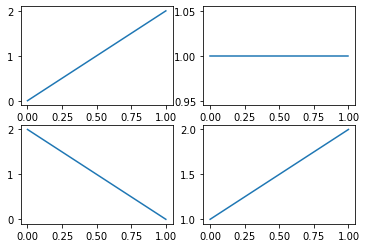

#### swcodingschool's classroom
# 데이터시각화 Visualization
### 데이터 시각화란?
- 데이터 분석 결과를 쉽게 이해할 수 있도록 시각적으로 표현하고 전달하는 과정
- 디지털시대의 학습자는 SNS, 영상, 클라우드 서비스 등 무한정의 데이터에 노출되어 있음
- 데이터의 표현, 수용방식의 변화가 필요하며, 특히 정보를 직관적이고 효율적으로 제공하는 데이터 시각화의 필요성이 증가하는 추세

### 데이터 시각화의 필요성
- 많은 양의 데이터를 한눈에 볼 수 있음
- 데이터 분석에 전문 지식이 없어도 누구나 쉽게 해당 데이터를 인지하고 활용할 수 있음
- 단순한 데이터의 요약, 통계보다 정확한 데이터 분석 결과를 도출해 낼 수 있음
- 단순히 나열된 데이터에서는 확인하기 어려운 데이터의 의미와 새로운 정보를 파악할 수 있음

### 파이썬에서의 데이터시각화 방법
- 파이썬에서는 데이터를 시각화하기 위한 다양한 라이브러리를 제공
  - 각 라이브러리마다 특징이 있기 때문에, 각자 사용하기 편한 것을 사용하면 됨
- 주로 그래프를 쉽게 그릴 수 있도록 도와주며, 3D, 원형, 막대 등 다양한 옵션이 잇음
- 파이썬의 주요 시각화 모듈
  - matplotlib, seaborn, plotnine, folium, pyecharts, wordcloud 등

# Matplotlib
### Matplotlib이란?
- 파이썬에서 데이터 시각화를 위해 가장 많이 사용하는 대표 라이브러리
- MATLAB 프로그램과 유사한 인터페이스
- 다양한 출력형식 지원(PNG, JPG, SVG 등)
- 그래프의 종류, 축, 눈금선, 범례 등 상세한 설정 가능
- pip install matplotlib 명령어로 설치


```python
# [실습]matplotlib을 설치
# !pip install matplotlib
!pip install --upgrade --user pip 
!pip install matplotlib
```

### figure와 subplot의 개념
- figure : subplot(그래프의 영역)을 생성하는 전체 프레임
- subplot : 그래프를 그리기 위한 영역

### 그래프를 생성하기 위한 함수
- add_subplot(특정위치) : 특정 위치에 그래프 생성하는 함수
  - add_subplot(\[총 행의 수\],\[총 열의 수\],\[subplot 번호\])
- subplots() : figure와 subplot 동시 생성
  - subplots(생성할 subplot의 행, 열)
- plot() : 꺽은선 그래프를 생성하는 함수
  - 파이썬의리스트, numpy의 ndarray, pandas의Seriese 모두 사용 가능함
- bar() : 수량을 막대 길이로 표현하는 막대 그래프를 그리는 함수
- twinx(), twiny() : 서로 다른 단위의 2개의 x,y축을 표시할 경우 사용
- scatter() : 산점도, 그래프상의 점의 위치로 데이터의 분포와 관계를 파악할 수 있음
- pie() : 원 그래프, 데이터 간 비율을 한눈에 파악할 수 있음. label과 데이터로 표현, figsize로 그래프의 크기 설정 가능


```python
#[실습]
import matplotlib.pyplot as plt
%matplotlib inline

figure = plt.figure()
axes1 = figure.add_subplot(1, 2, 1)
axes2 = figure.add_subplot(1, 2, 2)

plt.show()

```


    

    


```python
#[실습]
import matplotlib.pyplot as plt
%matplotlib inline

figure = plt.figure()
axes1 = figure.add_subplot(2, 2, 1)  # 행,열, 번호  순서
axes2 = figure.add_subplot(2, 2, 2)
axes3 = figure.add_subplot(2, 2, 3)
axes4 = figure.add_subplot(2, 2, 4)

axes1.plot([0,2])  # y축에 표시할 값
axes2.plot([1,1])
axes3.plot([2,0])
axes4.plot([1,2])

plt.show()

```


    

    


```python
#[실습] 꺽은선 그래프 
import matplotlib.pyplot as plt
%matplotlib inline

figure = plt.figure()
axes = figure.add_subplot(1, 1, 1)  # 행,열, 번호  순서

x = [0,2,4,6]
y = [0,4,0,2]
axes.plot(x,y)

plt.show()
```


    

    


```python
#[실습] 꺽은선 그래프 : 하나의 그래프에 plot을 여러 개 중첨하여 생성
import matplotlib.pyplot as plt
%matplotlib inline

figure = plt.figure()
axes = figure.add_subplot(1, 1, 1)  # 행,열, 번호  순서

x = [0,2,4,6]
y = [0,4,0,2]
x2 = [0,1,2,3,4,5,6]
y2 = [1,2,3,4,5,6,7]
axes.plot(x,y)
axes.plot(x2,y2)

plt.show()
```


    

    


```python
#[실습] 꺽은선 그래프 : 하나의 그래프에 plot을 여러 개 중첨하여 생성
import matplotlib.pyplot as plt
%matplotlib inline

figure = plt.figure()
axes = figure.add_subplot(1, 1, 1)  # 행,열, 번호  순서

x = [0,2,4,6]
y = [0,4,0,2]
x2 = [0,1,2,3,4,5,6]
y2 = [1,2,3,4,5,6,7]
# linestyle : 선의 형태, solid, dotted, dashdotted, dashed
# color : 선의 색상 지정, black, red, blud, green 등
# marker : 마커모댱, 원모양o, 삼각형^, 화살표> 등
axes.plot(x,y, color='r', linestyle='dotted', marker='*')
axes.plot(x2,y2, color='k', linestyle='dashed', marker='o')

plt.show()
```


    

    


```python
#[실습] bar() 수량을 막대 길이로 표현하는 막대 그래프 그리기
import matplotlib.pyplot as plt
%matplotlib inline

figure = plt.figure()
axes = figure.add_subplot(1, 1, 1)  # 행,열, 번호  순서

x = [1,2,3,4]
y = [1,4,3,2]

axes.bar(x, y)

plt.show()
```


    

    


```python
#[실습] bar() 수량을 막대 길이로 표현하는 막대 그래프 그리기
import matplotlib.pyplot as plt
%matplotlib inline

figure = plt.figure()
axes = figure.add_subplot(1, 1, 1)  # 행,열, 번호  순서

x = [1,4,7,10]
y = [1,4,3,2]
x2 = [2,5,7,11]    # 값 7 중복 ==> 합쳐짐
y2 = [2,3,4,5]

axes.bar(x, y)
axes.bar(x2, y2)

plt.show()
```


    

    


```python
#[실습] twinx(), twiny() 
import matplotlib.pyplot as plt
%matplotlib inline

figure = plt.figure()
axes = figure.add_subplot(1, 1, 1)  # 행,열, 번호  순서
axes2 = axes.twinx()   # 서로 다른 단위의 x축 추가

x = [1,2,3,4]
y = [3,1,11,9]
x2 = [1,2,3,4]
y2 = [1,2,3,1]

# 그래프 생성시 label 지정 및 legend()로 범례 생성 가능
axes.bar(x,y,color='r', label='bar')
axes2.plot(x2,y2,label='plot')

axes.legend(loc=1)
axes2.legend(loc=2)

plt.show()
```


    

    


```python
#[실습] scatter
import matplotlib.pyplot as plt
%matplotlib inline

figure = plt.figure()
axes = figure.add_subplot(1, 1, 1)  # 행,열, 번호  순서

x=[1,2,3,4,5,6]
y=[6,4,1,2,8,2]
x2 = [1,2,3,4,5,6]
y2 = [2,3,4,5,6,7]
axes.scatter(x,y)
axes.scatter(x2,y2)
plt.show()
```


    

    


```python
#[실습] pip() 원 그래프
import matplotlib.pyplot as plt
%matplotlib inline

figure = plt.figure(figsize=(3,3))
axes = figure.add_subplot(1, 1, 1)  # 행,열, 번호  순서

label=['a', 'b', 'c']
data = [30,20,50]

axes.pie(data, labels=label)

plt.show()
```


    

    


# Wordcloud 모듈 활용
### WrodCloud 모듈이란?
- 파이썬에서 단어의 중요도에 따라 단어의 크기, 색 등을 변화시켜 어떤 단어가 중요한지 보여 줄 수 있는 데이터 시각화 모듈
- 중요한 단어나 키워드를 직관적으로 보여 줄 수 있음
- pip install wordcloud 명령어로 설치


```python
# wordcloud 설치
#!pip install wordcloud  # 오류가 발생하면...
# https://www.lfd.uci.edu/~gohlke/pythonlibs/#wordcloud
# 위 링크 클릭하고  파이썬 버전에 맞추어 
# wordcloud‑1.8.1‑cp38‑cp38‑win_amd64.whl 다운받아
# 현재 폴더에 옮기고 아래와 같이 설치한다.
!pip install wordcloud-1.8.1-cp39-cp39-win_amd64.whl
```

    Processing .\wordcloud-1.8.1-cp39-cp39-win_amd64.whl
    Requirement already satisfied: numpy>=1.6.1 in c:\developer\python\python39\lib\site-packages (from wordcloud==1.8.1) (1.20.1)
    Requirement already satisfied: pillow in c:\developer\python\python39\lib\site-packages (from wordcloud==1.8.1) (8.1.0)
    Requirement already satisfied: matplotlib in c:\developer\python\python39\lib\site-packages (from wordcloud==1.8.1) (3.3.4)
    Requirement already satisfied: pyparsing!=2.0.4,!=2.1.2,!=2.1.6,>=2.0.3 in c:\developer\python\python39\lib\site-packages (from matplotlib->wordcloud==1.8.1) (2.4.7)
    Requirement already satisfied: python-dateutil>=2.1 in c:\developer\python\python39\lib\site-packages (from matplotlib->wordcloud==1.8.1) (2.8.1)
    Requirement already satisfied: kiwisolver>=1.0.1 in c:\developer\python\python39\lib\site-packages (from matplotlib->wordcloud==1.8.1) (1.3.1)
    Requirement already satisfied: cycler>=0.10 in c:\developer\python\python39\lib\site-packages (from matplotlib->wordcloud==1.8.1) (0.10.0)
    Requirement already satisfied: six in c:\users\dears\appdata\roaming\python\python39\site-packages (from cycler>=0.10->matplotlib->wordcloud==1.8.1) (1.15.0)
    Installing collected packages: wordcloud
    Successfully installed wordcloud-1.8.1
    

### WordCloud의 생성과 출력
- WordCloud 모듈로 워드 클라우드 생성
  - matplotlib 모듈로 생성한 워드 클라우드를 출력
    


```python
import wordcloud
import matplotlib.pyplot as plt
%matplotlib inline
keywords = {'Hello':5, 'Python':3, 'Crawl':5, 'Visual':3}

wc = wordcloud.WordCloud()
cloud = wc.generate_from_frequencies(keywords)

plt.figure()
plt.imshow(cloud)
plt.show()
```


    

    


```python
# 한글로 출력시 한글 깨짐을 방지하기 위해서는 font 변경 필요
import wordcloud
import matplotlib.pyplot as plt
%matplotlib inline
keywords = {'안녕':5, '파이썬':3, '크롤링':5, '시각적':3}

wc = wordcloud.WordCloud(font_path='C://indows/Fonts/gulim.ttc')
cloud = wc.generate_from_frequencies(keywords)

plt.figure()
plt.imshow(cloud)
plt.show()
```


    

    


```python
# 배경색상 및 크기 변경
import wordcloud
import matplotlib.pyplot as plt
%matplotlib inline
keywords = {'안녕':5, '파이썬':3, '크롤링':5, '시각적':3}

wc = wordcloud.WordCloud(font_path='C://indows/Fonts/gulim.ttc', background_color='white', width=800, height=600)
cloud = wc.generate_from_frequencies(keywords)

plt.figure()
plt.imshow(cloud)
plt.show()

## savefig() 활용, 이미지를 파일로 저장할 수도 있음
# figure.savefig('wordCloud.png')
```


    

    

